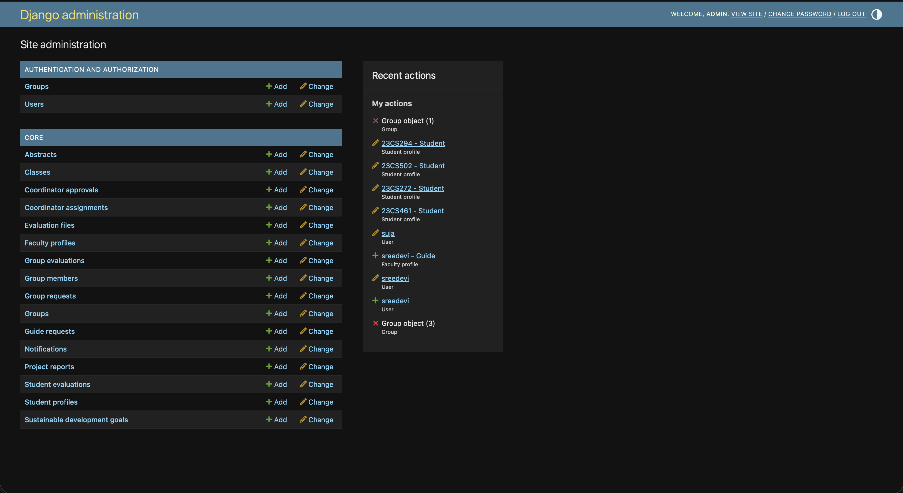
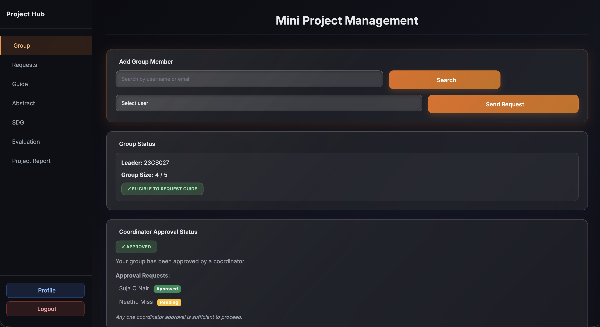
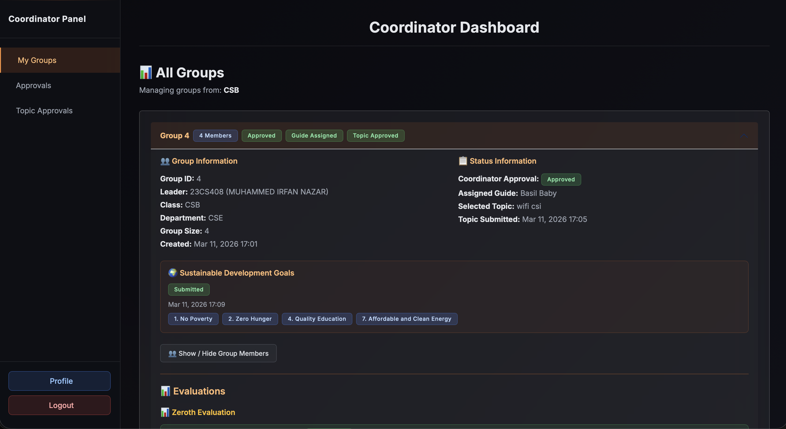
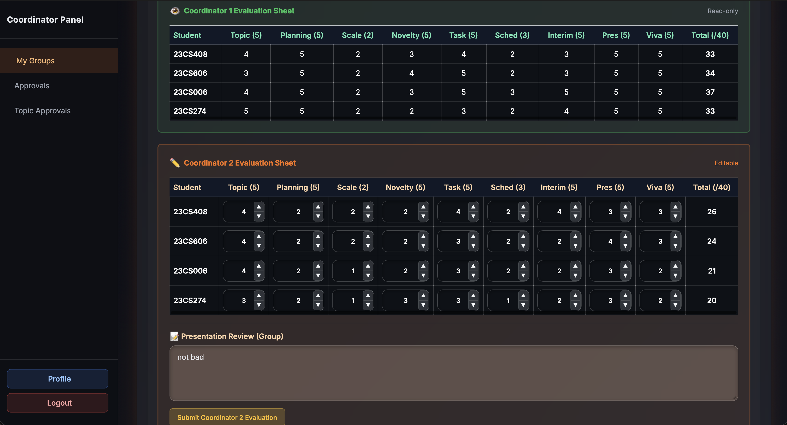

# ProjectHub – Role-Based Evaluation Platform

🚀 **Live Demo:** https://projecthun.onrender.com

A production-deployed Django web application for managing academic project evaluations through role-based workflows involving Admins, Coordinators, Guides, and Students.

## Problem
Manual academic project evaluation workflows are inefficient, error-prone, and lack transparency across stakeholders.

## Solution
Built a centralized role-based workflow platform for project management, evaluator coordination, and multi-stage evaluation tracking.

## Technical Highlights
- Designed normalized relational database models using Django ORM
- Implemented role-based authentication and authorization
- Built conditional multi-stage evaluation workflows
- Resolved evaluator workflow inconsistencies through database schema redesign
- Optimized ORM queries using `select_related` and `prefetch_related`
- Deployed the application to production using Render

## Tech Stack
- Python
- Django
- SQL
- HTML
- CSS
- JavaScript
- Render

## Key Features
- Role-based authentication (Admin, Coordinator, Guide, Student)
- Project group creation and management
- Guide allocation workflow
- Multi-stage evaluation system:
  - Zeroth Evaluation → Guide + any one coordinator
  - First/Second Evaluation → Guide + both coordinators
- Dynamic evaluator submission tracking
- Attendance and report evaluation support

## Screenshots

### Admin Dashboard


### Student Dashboard


### Coordinator Dashboard


### Evaluation Workflow


## Deployment
Deployed on Render.

Production deployment considerations:
- environment variable management
- static file configuration
- production Django settings
- hosted application deployment

## Key Learnings
- Designing multi-user workflow systems
- Backend state management and business logic handling
- Database schema redesign for evolving requirements
- Query optimization and debugging
- Production deployment fundamentals

## Local Setup
```bash
git clone https://github.com/yed-uoo/project-evaluation-system-django
cd project-evaluation-system-django
pip install -r requirements.txt
python manage.py migrate
python manage.py runserver
```

## Future Improvements
- REST API support
- JWT authentication
- Docker deployment
- Improved analytics dashboard
